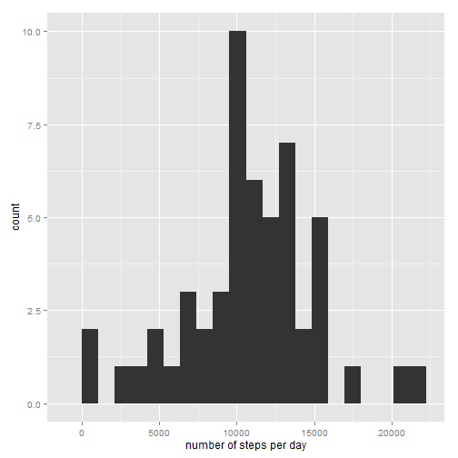
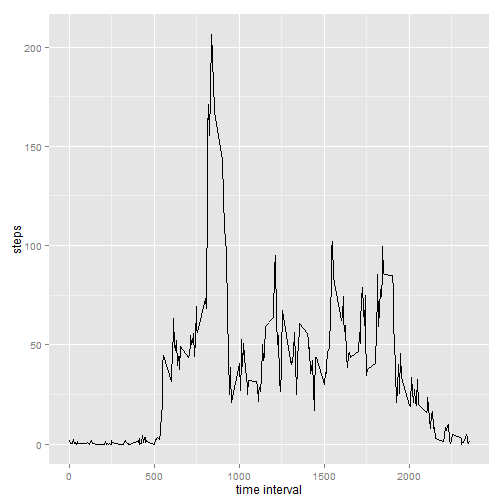
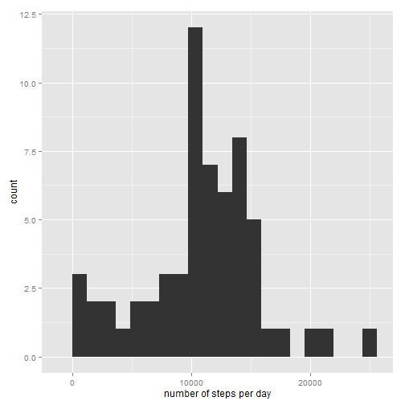
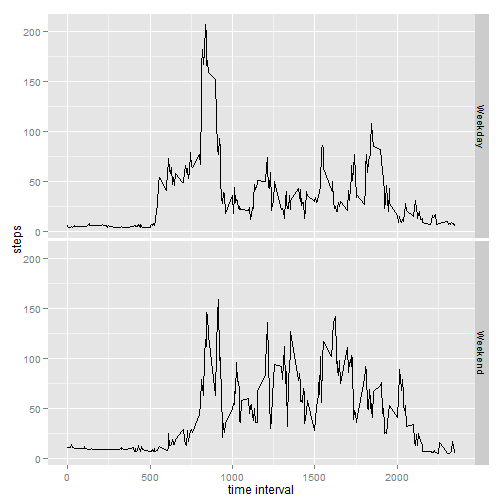

# Reproducible Research: Peer Assessment 1


## Loading and preprocessing the data

```r
activity <- read.csv("activity.csv")
```


## What is mean total number of steps taken per day?
The following plot depicts a histogram of total number of steps taken per day over two months

```r
library(ggplot2)

steps <- aggregate(steps ~ date, activity, FUN = sum)
qplot(steps$steps, binwidth = max(steps$steps)/20, xlab = "number of steps per day")
```

 

```r
stepsMean <- mean(steps$steps)
stepsMedian <- median(steps$steps)
```


Average steps per day: 10766.2. Median: 10765.

## What is the average daily activity pattern?
The following plot depicts the average daily activity pattern (average number of steps taken in 5-minute
intervals throughout a day)


```r
stepsByInterval <- aggregate(steps ~ interval, activity, FUN = mean)
maxSteps <- stepsByInterval[which.max(stepsByInterval$steps), ]

ggplot(stepsByInterval, aes(x = interval, y = steps)) + geom_line() + xlab("time interval")
```

 


The maximum number of steps, on average, is taken in interval 835
 (206.1698)

## Imputing missing values
There are 2304 missing values in the dataset.
The following plot depicts a histogram of total number of steps taken each day where missing
values for number of steps are replaced by mean number of steps for the same interval value.


```r
missing <- which(is.na(activity$steps))
replacements <- merge(activity[missing, ], stepsByInterval, by = "interval")$steps.y
activity[missing, "steps"] <- round(replacements)

steps <- aggregate(steps ~ date, activity, FUN = sum)
qplot(steps$steps, binwidth = max(steps$steps)/20, xlab = "number of steps per day")
```

 


After imputing missing values the average steps per day is 10765.6 
(-0.55 change), median is 11015.0 
(+250.00 change).


## Are there differences in activity patterns between weekdays and weekends?

The following plot depicts the average daily activity pattern (average number of steps taken in 5-minute
intervals throughout a day) for weekdays and weekends


```r
isWeekend <- as.POSIXlt(activity$date)$wday %in% c(0, 6)
activity$typeOfDay <- factor(isWeekend, levels = c(F, T), labels = c("Weekday", 
    "Weekend"))
stepsByTypeOfDay <- aggregate(steps ~ interval + typeOfDay, activity, FUN = mean)

ggplot(stepsByTypeOfDay, aes(x = interval, y = steps)) + facet_grid(typeOfDay ~ 
    .) + geom_line() + xlab("time interval")
```

 

